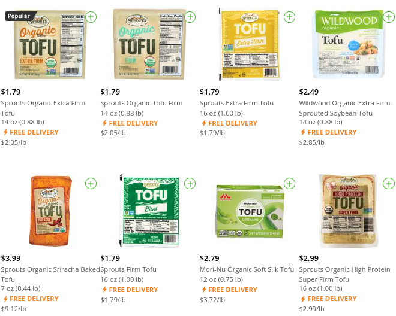

user-scripts 
===

A collection of user scripts for use with [TamperMonkey](https://www.tampermonkey.net/) or 
[GreaseMonkey](https://www.greasespot.net/).

### [Instacart Price-per-Unit](https://github.com/b0o/user-scripts/tree/master/instacart-ppu.user.js)

For each item listing, this user script calculates the total
weight/volume/count and shows a price per unit. Volume units are normalized to
gallons and weight to pounds.

## License

GNU General Public License, version 3.0 or later
